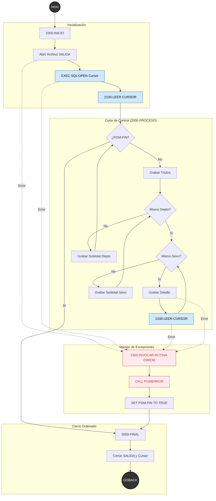

🔂 Programa **COBOL Batch** (DB2).

**Qué resuelve**
Genera un reporte batch desde DB2 con datos agrupados, totales y promedios, usando lógica de doble corte de control.

**Enfoque de solución**
El problema se resuelve combinando tres capas:

1. Acceso a datos
   → SQL con CURSOR sobre DB2

2. Procesamiento en COBOL
   → lógica de doble corte de control
   → manejo de estados con niveles 88

3. Presentación
   → reporte paginado con LINAGE COUNTER

**Algunos puntos de diseño en el código**

* Estructura de INICIO-PROCESO-FINAL;
* Manejo de estados x medio de niveles 88;
* Uso de CURSOR SQL;
* Paginado automático x medio de LINAGE COUNTER;
* Centrado dinámico de subtítulos mediante FUNCTION TRIM y FUNCTION LENGTH
* Doble corte de control x medio de PERFORM-INLINE;
* Captura de fecha x medio de Función Intrínseca;
* Manejo de errores centralizado en un subprograma (rutina) reutilizable mediante
código defensivo para evitar ABENDs — el programa intercepta errores en cada
punto crítico (ON SIZE ERROR, DECLARATIVES, WHENEVER, variable indicadora de DB2, IS NUMERIC, ETC).
Ante cualquier error: cierra lo que se pueda cerrar, emite un mensaje detallado
por DISPLAY y termina con RC 9999 para que el operador sepa exactamente qué pasó
y dónde.
* Integración con **DSNTIAR** — ante errores DB2, el programa pasa el SQLCA
completo a la rutina (RUTERRBA), que internamente invoca la rutina IBM DSNTIAR para
formatear el mensaje de error en texto legible por el operador en el spool,
eliminando la necesidad de interpretar códigos numéricos.

*----------------------------------------------------------------------------------------------------------------------------------*
NOTA SOBRE EL USO DE GO TO:
Su uso esta **segmentado exclusivamente** para manejar el flujo de ejecución dentro del **estado de error**.
No interfiere en el flujo de la lógica de negocio, el cual respeta la programación estructurada y la ejecución TOP-DOWN.
*----------------------------------------------------------------------------------------------------------------------------------*
NOTA SOBRE FILE STATUS: se declara directamente sobre WS-ERR-FILE-STATUS (variable de la COPY de rutina de error), eliminando el MOVE intermedio y estandarizando el manejo de errores en todos los programas que adopten esta arquitectura.
*----------------------------------------------------------------------------------------------------------------------------------*

 
** CAPTURA DE SALIDA EMULADOR WX3270 **

 
** CAPTURA DE SALIDA VSCODE + ZOWE **

 
** CAPTURA DE SALIDA interfaz web de z/OSMF (z/OS Management Facility) **

 
** CAPTURA ERROR ARCHIVO **

 
** CAPTURA ERROR SQL **

